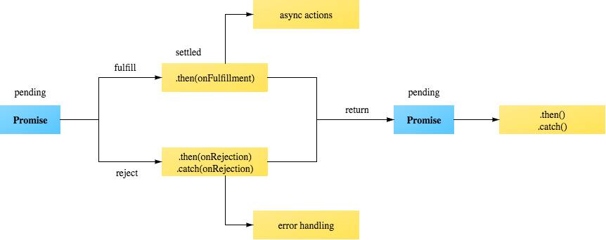

# Challenge: get the dogs and their images

Using this two endpoints
- https://dog.ceo/api/breeds/list  (returns a list of dog breeds)
- https://dog.ceo/api/breed/{breedName}/images/random (returns thnpe URL of an image of the selected breed)

more info in 
- https://dog.ceo/dog-api/

You have to print using console.log the breeds containing more than 4 vocals in their breed name
along with the URL of an image associated to this breed, using the format:

{breedName} -- {breedImgUrl}

The order of this messages should be the same as the order of the breed names.
Example:
- receiving ['lorem', 'ipsum','chihuahua', 'pomerania']

you should print something like that:

    airedale -- https://images.dog.ceo/breeds/airedale/n02096051_6747.jpg
    chihuahua -- https://images.dog.ceo/breeds/chihuahua/n02085620_4998.jpg
    cotondetulear -- https://images.dog.ceo/breeds/cotondetulear/100_2013.jpg
    groenendael -- https://images.dog.ceo/breeds/groenendael/n02105056_5212.jpg
    mexicanhairless -- https://images.dog.ceo/breeds/mexicanhairless/n02113978_3375.jpg
    pomeranian -- https://images.dog.ceo/breeds/pomeranian/n02112018_2728.jpg
    weimaraner -- https://images.dog.ceo/breeds/weimaraner/n02092339_6678.jpg

This output can change everyday, because it's ramdon.

